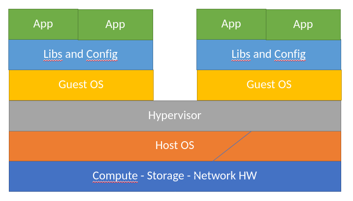
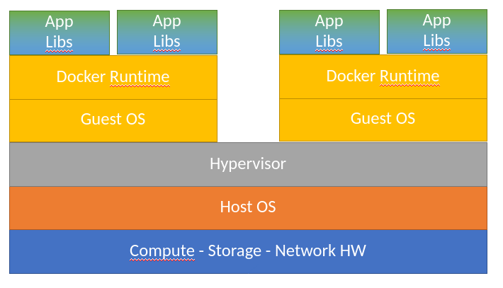

# **Kubernetes**

Warum steigen alle auf den Zug auf.

## Rahmen

* Fokus​
  * Was ist Kubernetes​
  * Was ändert sich durch Kubernetes​

* Nicht im Fokus​
  * Kubernetes danach benutzen können​
  * Wie funktioniert Kubernetes unter der Haube​

## Agenda

### Docker​
### Kubernetes​
### Helm
### Infrastructure as Code​

## Der Gegenstand der Betrachtung

* Hat sich gewandelt​
* Von schwarze Kisten mit Software​
* Zu einzelne Komponenten die in einer wohldefinierten Umgebung laufen  

## Server


## Server 

* Textuelle Beschreibung der benötigten Hardware​
* Netzwerk Diagramme​
* Installation von OS mit Libs​
* Installation von Software​
* Abgleich über mehrere Produkte schwierig​
* Wird für jedes Produkt neu erfunden

## Virtuelle Maschine



## Virtuelle Maschine

* Formale und deklarative Beschreibung von​
  * Compute​
  * Storage​
  * Netzwerk​
* Installation von OS mit Libs​
* Installation von Software​
* Abgleich über mehrere Produkte schwierig​
* Wird für jedes Produkt neu erfunden

## Terraform

``` terraform
resource "azurerm_linux_virtual_machine" "main" {
  name                            = "${var.prefix}-vm"
  size                            = "Standard_F2"
  admin_username                  = "adminuser"
  admin_password                  = "P@ssw0rd1234!"
  disable_password_authentication = false

 source_image_reference {
    publisher = "Canonical"
    offer     = "UbuntuServer"
    sku       = "16.04-LTS"
    version   = "latest"
  }

```
## Docker



## Docker

* Formale und deklarative Beschreibung von​
  * Alle Abhängigkeiten einer Applikation​
  * Wie eine Applikation mit Abhängigkeiten verpackt wird ​
  * Netzwerk Schnittstellen​
  * Wie Software gebaut wird
* Abhängigkeit zum Host System ist nur noch Docker und Netzwerk​
* Keine volle Virtualisierung


## Docker Beispiel

Ein Mini Webserver in Go gebaut und verpackt mit Docker

* Erst wird er gebaut
* Dann aus dem Ergebnis ein Docker Image gemacht 


## Dockerfile

``` Docker
FROM golang:1.7.3 AS builder

WORKDIR /root/go
COPY main.go main.go
RUN CGO_ENABLED=0 GOOS=linux go build -a -o app .

FROM alpine:latest
WORKDIR /root/
COPY static static
COPY --from=builder /root/go/app .
EXPOSE 9000

CMD ["./app"]
````

## Container Bauen 

Build

``` bash
docker build -t newsimwebregistry.azurecr.io/tim/hello-server:1.0.0 .  
```

Run

```bash
docker run -p 8888:9000 newsimwebregistry.azurecr.io/tim/hello-server:1.0.0
```

Push

```bash
docker push newsimwebregistry.azurecr.io/tim/hello-server:1.0.0
```

## VMS mit Docker

* Formale und deklarative Beschreibung von​
  * Compute
  * Storage
  * Netzwerk
  * Bau Prozess
  * Abhängigkeiten
* Was fehlt?

## Container Ochestrierung

* Welche und wieviele Container laufen?
* Auf welchen VMs laufen die Cotainer?
* Welche Services bietet welcher Container?
* Wie sind Container aus dem Internet erreichbar?
* ...

## Kubernetes

 

## Kubernetes Bausteine

* Namespace - Groupiert in einem Namensraum
* Node - Ein Virtuelle Maschine
* Pod - Ein Container
* Deployment - Wieviele Instanzen und wie ein Pod laufen soll
* Physical Volume Claim - Storage Anforderungen
* Service - Nutzbare Netzwerk Dienste
* Ingress - Externer Zugriff auf Services (http/https)

## Kubernetes Deployment Beispiel

```yaml
kind: Deployment
metadata:
  name: hello-server-deployment
spec:
  replicas: 3
  template:
    spec:
      containers:
      - name: hello-server
        image: newsimwebregistry.azurecr.io/tim/hello-server:1.0.0
        ports:
        - containerPort: 9000
        resources:
          requests:
            memory: 256Mi
```

## Kubernetes Service Beispiel

```yaml
apiVersion: v1
kind: Service
metadata:
  name: hello-service-service
  labels:
    app: hello-server
spec:
  selector:
    app: hello-server
  ports:
  - port: 9000
    targetPort: 9000
```

## Kubernetes Ingress Beispiel

```yaml
apiVersion: networking.k8s.io/v1beta1
kind: Ingress
metadata:
  name: hello-server-ingress
spec:
  tls:
  - hosts:
    - tim.newsimweb.cloud
    secretName: tim-tls
  rules:
  - http:
      paths:
      - path: /hello
        backend:
          serviceName: hello-server-service
          servicePort: 9000
```

## Helm

* Packt mehrere yaml Datei in ein Release zusammen
* Hat einen Templatemechanismus für die Yaml Dateien
* Repository von Releasen
* Release Installation
* Release Rollbacks

## Helm Befehle

```bash
install:
helm install hello-server-release hello-server -n hello-server

update:
helm upgrade hello-server-release hello-server -n hello-server

rollback:
helm rollback -n hello-server hello-server-release  
```

## Infrastructure as Code

* Damit ist letztlich alles deklarativ in git abgelegt
* Alles ist vollständig automatisierbar
  * Vom Einchecken einer Änderung
  * Bis zur Auswirkung auf den Cluster
* Alle Artefakte liegen in Repositories
* Letztlich kann ein einziges _helm install_ ein komplettes ICAS installieren
* Autmatisierte Tests sind der Schlüssel

## Referenzen

* [Kubernetes](https://kubernetes.io/)
* [Helm](https://helm.sh)
* [docker](https://docker.io)
* [Git Repo](https://github.com/timgesekus/kubernetes-vortrag)
